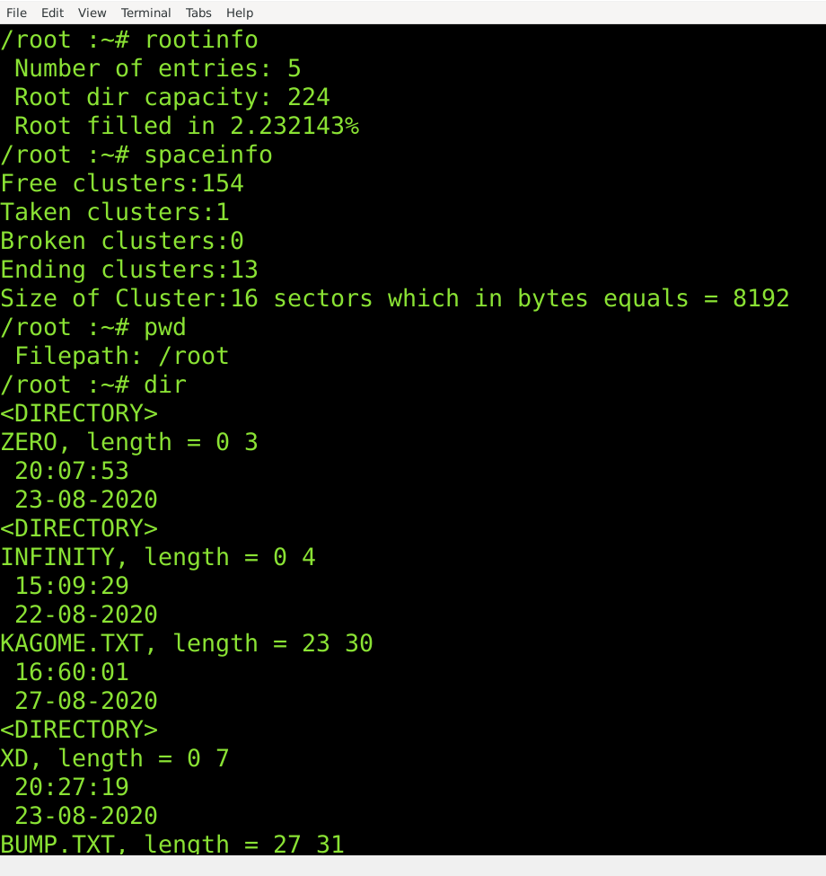
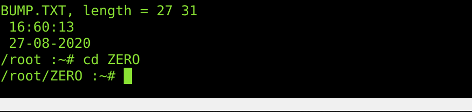

# FAT12
It's a project for my studies(Operating Systems).
## Acquired knowledge
- Got the basic info about FAT12, how to find files in FAT12, how to move in File Allocation Table;
- I understand how to print content of a file, how to get some basic information about it;
- Some knowledge about operations on files;
### Sample images showing tests

